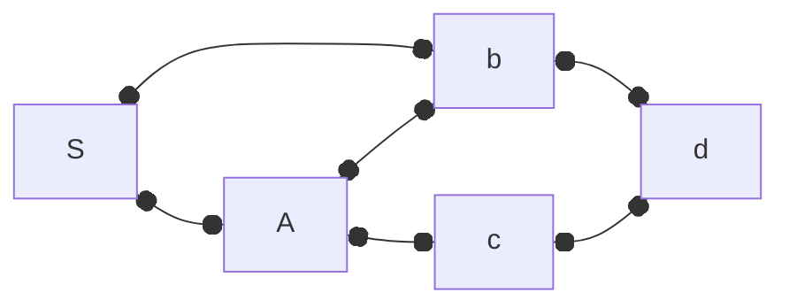

```
buscaGenerica(G = (V, E), S) {
	for v in V {
		encontrado[v] = 0
	}
	encontrado[S] = 1
	
	while (existe (u, v) em E : encontrado[u] == 1 && encontrado[v] == 0) {
		encontrado[v] = 1
	}
	
// Eficiência: O(n * m)	(n = número de nós, m = número de arestas médio que ligam em um nó - 1)
}
```