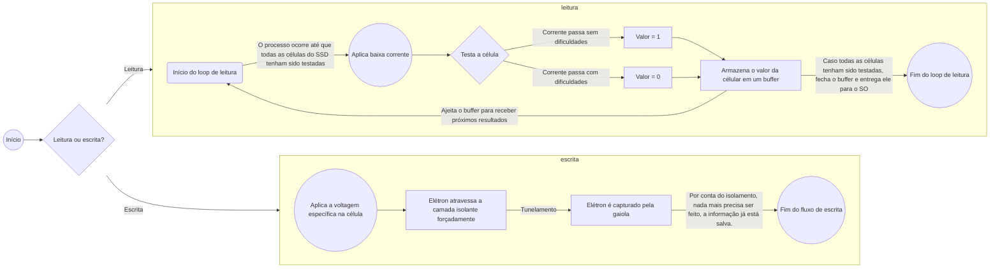
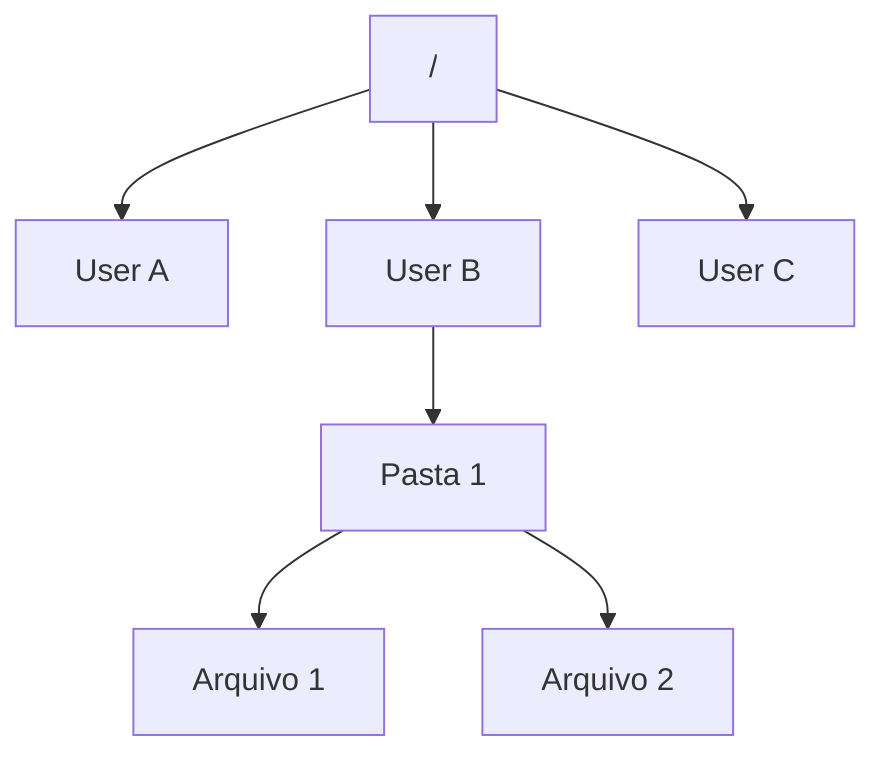

# Gerenciamento de Arquivos

Sabemos que um computador precisa gerenciar tanto a memória volátil (primária) para garantir o bom funcionamento das aplicações em execução, **mas também é preciso gerenciar a memória não-volátil (secundária) para garantir o armazenamento *persistente* de informações.** 

Para isso, vamos entender primeiro como **são constituídos os dispositivos de memória secundária** para, só depois, entendermos **como o SO faz a ponte entre o hardware e o software para a manipulação de informações na memória secundária**. Depois de entender como funciona a memória persistente e como ocorre essa troca de informações entre o SO e o hardware, finalmente, vamos entender **como o SO manipula e gerencia arquivos**.

## Dispositivos de memória Secundária

Um dispositivo de memória secundária é um HDD/SSD que serve para armazenar arquivos **persistentemente**. Um armazenamento é considerado *persistente* se, ao desligar a máquina, a informação não se perde. Isso é o que diferencia os dispositivos de memória persistente da memória RAM, enquanto a RAM é mais rápida e volátil, a memória secundária é mais lenta e persistente. Essa diferença na velocidade está intrinsecamente ligada a questão da **volatilidade**: a memória secundária é mais lenta **justamente** por permitir a persistência dos dados em memória.

### HDDs como funcionam?

Um HD ou Hard Disk é um dispositivo que armazena memória em discos magnéticos. Para interagir fisicamente com os discos, o HD possuí cabeças de leitura/escrita que são posicionadas na posição exata de escrita do disco. O Disco magnético em si é dividido de maneira **geométrica** (física) em:
- **Discos**: Os discos magnéticos em si.
- **Trilhas**: Anéis concêntricos.
- **Setores**: É a menor unidade de armazenamento endereçável dentro de uma trilha, geralmente 4KB.
- **Cilindros**: Conjunto de trilhas alinhadas verticalmente através de vários discos.

Essa divisão é o que proporciona a tradução do mapeamento físico no lógico. Cada HD exporta sua geometria para o SO através de seu **device driver**, para que assim o SO saiba como traduzir o endereço lógico no físico.

Agora, pensando no SO, o Disco é dividido de maneira **lógica** em:
- **Bloco**: Grupo de setores, que somados totalizam um tamanho X, sendo esse tamanho X a menor unidade utilizada pelo SO para ler e gravar arquivos. Geralmente, um bloco tem o tamanho de uma **página virtual de memória**, para que seja facilitada o carregamento dos dados lidos da memória secundária para a memória primária.
- **Partições**: Divisão primária do Disco, delimitando onde começa e termina cada sistema de arquivos gravado e definido para aquele hardware, permitindo o isolamento de dados e sistemas inteiros.

> OBS: existe uma cabeça de leitura/gravação **por disco**, e todas se movem **juntas** para a mesma posição. Não é possível mover apenas uma cabeça de maneira independente.

#### Fluxo básico de leitura/escrita

### SSDs como funcionam?

Um SSD ou Solid State Driver, diferentemente dos HDDs, não possuí nenhuma parte que se move, sendo **100% eletrônico**. Isso proporcionou um aumento **exponencial** na velocidade de utilização em comparação com os HDDS, mas o custo por hardware também aumentou e a capacidade total de armazenamento, muitas vezes, é menor que a de um HDD.

O SSD é construído em cima da **Memória NAND Flash**. Dentro de cada chip desse de memória, existem incontáveis *transistores de Porta Flutuante* - ou, em tecnologias mais modernas: *Charge Trap Flash* - que funcionam, básicamente como uma **gaiola de elétrons** que é **fortemente isolada** por uma camada de *óxido* (excelente isolante elétrico). Sendo assim, se a gaiola está com um elétron capturado, seu valor é **0** e se estiver vazia é **1**. Então, em cada chip, as milhares de gaiolas existentes formam o código binário da informação. E como a gaiola **mantém o elétron capturado, mesmo sem energia**, graças ao isolamento proveniente da camada de óxido, a informação não se perde.

> É isso esse isolamento dos transistores é a principal diferença entre o SSD e um chip de memória RAM.

O SSD organiza a informação em uma grade estrita e definida, sendo essa a sua forma de divisão física, em:
- **Célula**: Cada transistor individual.
- **Página**: Agrupamento de milhares de Células, sendo essa a menor unidade que o SSD consegue ler e escrever dados.
- **Bloco**: Agrupamento de milhares de Páginas, sendo essa a menor unidade que o SSD consegue *apagar*.

Assim como no HDD, é essa divisão que proporciona a tradução dos endereços lógicos em endereços físicos, feita pelo **device driver**, do SSD.

Agora, pensando no SO, o SSD é dividido de maneira **lógica** em:
- **Bloco**: Grupo de blocos do SSD, que somados totalizam um tamanho X, sendo esse tamanho X a menor unidade utilizada pelo SO para ler e gravar arquivos. Geralmente, um bloco tem o tamanho de uma **página virtual de memória**, para que seja facilitada o carregamento dos dados lidos da memória secundária para a memória primária.
- **Partições**: Divisão primária do Disco, delimitando onde começa e termina cada sistema de arquivos gravado e definido para aquele hardware, permitindo o isolamento de dados e sistemas inteiros.

> A divisão lógica do SSD é extremamente semelhante (quando não exatamente igual) à do SSD, justamente pois independente do tipo de hardware utilizado, o funcionamento do SO é o mesmo.

#### Fluxo de leitura e gravação em um SSD
- A **gravação** em um SSD envolve a aplicação de uma voltagem específica sobre uma célula, forçando um elétron a atravessar a camada isolante e entrar na gaiola - por meio de um fenômeno da física quântica chamado de **tunelamento**.
- Já a **leitura** em um SSD envolve a passagem de uma corrente baixa pela célula. Se a corrente passar sem dificuldades, a gaiola está vazia e seu valor é **1**, se a corrente encontrar dificuldades para passar por aquela célula, significa que os elétrons presos dentro da gaiola estão gerando um campo magnético que está gerando uma resistência para a corrente, e, portanto, o SSD sabe que aquela célula está preenchida, e se valor é **0**.

Agora que sabemos como o **hardware** se comporta, vamos entender como o **SO se comporta para armazenar memória persistentemente**

## Interação do SO com o hardware de memória secundária

O que nós precisamos entender sobre a manipulação de memória persistente pelo SO é:
- **Como o SO pede as informações para hardware?**
- **O que o SO faz com as informações recebidas pelo hardware?**

Essas perguntas são essenciais para entendermos como o SO lê e grava informações em memória secundária. O SO não tem acesso direto ao disco, ele precisa pedir as informações para o hardware, que deve aceitar o pedido e devolver as informações solicitadas. Essa comunicação pelo SO e o hardware é feita via **device driver**. Não vamos nos aprofundar muito sobre device drivers (agora, já que é nosso próximo tópico de estudo), mas o driver do nosso hardware espera uma requisição de leitura ou uma requisição de escrita.  Em resumo, ambas requisições devem ter:
- **onde** na organização lógica do SO está a informação requisitada/deseja-se gravar a informação
- número de bytes (**tamanho**) que se deseja ler/escrever.
- onde na **RAM** serão carregados os dados lidos/estão os dados a serem gravados.

Então, os SO mandam a requisição para os drivers de disco, que traduzem o endereço lógico em físico e manipulam seus respectivos hardwares, baseados na requisição feita pelo SO, executam a operação e retornam para o SO, ou uma confirmação - no caso da escrita - ou os dados requisitados - no caso da leitura.

> OBS: Os device drivers pedem o **endereço na RAM** na requisição pois são capazes de realizar *Direct Acess to Memory* (DMA), na memória RAM, podendo escrever ou ler conteúdos da **RAM** sem o intermédio do SO.

Isso responde nossa primeira pergunta: `'Como o SO pede as informações para o hardware?'`: O SO envia uma requisição contendo o endereço de memória lógico dos dados que serão manipulados, indicando qual operação será realizada (leitura ou escrita), indicando quantos bytes serão manipulados e o onde na RAM devem ser colocados os dados, em caso de leitura, ou, de onde na RAM devem ser retirados os dados, em caso de gravação. Uma vez enviada a requisição, o driver verifica a memória RAM da máquina, para ajeitar o espaço para inserir informações em caso de leitura ou para checar as informações já existentes,em caso de escrita, depois realiza a tradução do endereço lógico do **sistema de arquivos** em um endereço físico para o hardware de memória secundária, realiza os procedimentos necessários pré-operação (que divergem dependendo do tipo de hardware SSD ou HDD) e, finalmente, realiza a operação da requisição. Uma vez finalizada a operação, o driver sinaliza para a CPU que finalizou a operação requisitada pelo SO e uma interrupção é gerada para que o SO lide com a finalização da operação.

> Vale ressaltar que em caso de leitura, no momento em que a confirmação é enviada pelo driver, os dados lidos já estão em RAM para que o SO manipule eles. Isso implica que, uma vez acionado, o SO deve inserir esses dados na tabela de páginas do processo que requisitou eles. Em caso de leitura, a confirmação indica o fim da gravação dos dados em memória persistente.

Agora, uma vez que a operação requisitada é realizada, o SO precisa lidar com a resposta do driver, que pode ser - em caso de leitura - uma confirmação que significa que os dados já estão carregados em RAM, ou - em caso de escrita - que os dados já foram armazenados de maneira persistente, o que significa que, dependendo do intuito da aplicação, o SO já pode descarregá-los da RAM.

Pensando na leitura, ao receber a confirmação, o SO precisa realizar todo o processo de inserção dos dados na tabela de páginas do programa que requisitou essas informações, para que assim, finalmente, os dados possam ser utilizados de maneira efetiva pelo processo que utilizou a syscall `read()`. 

Isso responde nossa segunda pergunta: `O que o SO faz com as informações recebidas pelo hardware?`.

Pois bem, agora nós entendemos todo o fluxo da transferência de informações entre o SO e os dispositivos de memória secundária. Dito isso, agora precisamos entender como isso tudo é utilizado pelo SO para o **gerenciamento de arquivos**.

## Como o SO gerencia arquivos?

Essa é a pergunta principal que desejamos responder. Agora que somos capazes de entender o contexto por trás de conceitos fundamentais do gerenciamento de arquivos - **leitura e escrita de dados em memória secundária** - podemos subir um nível e começar a entender toda a organização lógica que um SO faz para manipular esses arquivos. Mas antes de entendermos o que é um **sistema de arquivos**, vamos primeiro entender **o que é um arquivo para o SO**.

### O que é um arquivo para o SO?
Um arquivo é uma unidade lógica de informação criada por um processo. Um dispositivo de memória secundária normalmente conterá milhões de arquivos em si, todos diferentes. Um arquivo deve ser armazenado **sempre** de maneira persistente, o que significa que caso o processo que o criou acabe, o arquivo ainda permanece, independente de estar atrelado a um processo ou não.

Um arquivo fornece uma maneira para o SO abstrair região de informações de um dispositivo de memória secundária, isolando o usuário dos detalhes de como e onde essas informações estão armazenadas fisicamente. Todo arquivo criado por um processo recebe um **nome**, que facilita o acesso pelo sistema de arquivos, posteriormente. O nome de um arquivo, comumente é separado em duas partes - por um '.' - sendo a segunda parte, a **extensão** do arquivo. A extensão, é uma indicação visual do **tipo** do arquivo. É visual, pois todo arquivo possuí, logo em seu início, um **magic number** que indica para quem estiver lendo o seu tipo, independentemente da extensão utilizada. O tipo de arquivo é importante pois processos podem estar esperando apenas tipos específicos de arquivos, e a extensão facilita a filtragem de arquivos por parte do sistema de arquivos.

Arquivos, internamente, podem ser organizados em:
- **Sequência de bytes**: o SO não sabe e não se importa com o que está escrito neste tipo de organização de arquivo. Seu significado é inteiramente atribuído por outra aplicação em UserSpace. Os bytes são colocados todos crus dentro do arquivo. É uma organização extremamente flexível, já que o SO se preocupa em ler bytes e carregar bytes apenas, enquanto so programas em UserSpace se preocupam com a interpretação.
- **Sequência de registros**: nesta organização, o arquivo é dividido em *registros de tamanho fixo*, o que significa que, por exemplo, cada linha representa um registro. Para que este tipo de organização funcione, é necessário que a operação de escrita **adicione ou sobreponha um registro**, e a de leitura **retorne um registro em uma posição especificada**. É uma organização muito usada em banco de dados pois facilita a manipulação de uma estrutura fixa de dados.
- **Árvore de registros**: nesta organização, o arquivo em si representa uma *árvore de registro de tamanhos variados*, o que significa que toda a manipulação de dados deste tipo de arquivo é feita utilizando a árvore que ele representa. Este, também é muito utilizado em bancos de dados, já que essa organização acelera muito a busca, inserção e remoção de registros dentro do arquivo.

Existem alguns tipos comuns de arquivo - *tipos esses diferentes do tipo que é sinalizado pela extensão de um arquivo, relacionados à estruturação interna* - vamos entendê-los:
- **Arquivo comum/executável**: Contém um cabeçalho que possuí: o magic number, algumas métricas e o um ponteiro para o início da seção de dados, além de algumas flags e fora do cabeçalho, existem a seção de texto, de dados, entre outras.
- **Diretório**: Contém vários cabeçalhos contendo o nome dos arquivos contidos em si, suas datas de criação, proprietários, permissões e por fim, logo após o fim do cabeçalho de cada arquivo, um ponteiro que aponta para o endereço do primeiro bloco do arquivo em si.

Entendemos, então, o que é um arquivo para o SO, e sabemos que os arquivos são unidades lógicas de informação que mapeiam blocos físicos do disco, mas como funciona esse mapeamento? 

#### Tipos de alocação

Dependendo do SO, o jeito que se decide quais blocos de disco vão ser alocados para cada arquivo pode variar, vamos entender os principais:
- **Alocação Contígua**: Consiste em armazenar cada arquivo como uma execução contígua de blocos de disco, ou seja *um do lado do outro*. É o tipo de alocação mais simples de ser implementado, pois basta saber o endereço do primeiro bloco e o número de blocos daquele arquivo para se obter o arquivo completo, e sabendo o número do primeiro bloco é possível descobrir qualquer outro bloco utilizando simples adições. É uma alocação extremamente eficiente para a **leitura**, pois basta buscar o bloco **uma vez** para lê-lo completamente. A desvantagem dessa alocação, é que o disco pode ficar **fragmentado** - isto é, com lacunas entre dois blocos - caso um arquivo que se encontra no meio de outros 2 (no ponto de vista dos blocos no disco) seja deletado.
- **Alocação por lista encadeada**: Consiste em manter cada arquivo como uma lista encadeada de blocos de disco. Para tanto, o início de cada bloco de disco é usado como um ponteiro para o próximo bloco. Diferente da alocação contígua, não existe fragmentação de disco nesse caso, pois sempre que um espaço ficar vago, outro arquivo pode preenchê-lo com um de seus blocos. Contudo, a facilidade para se encontrar qualquer bloco é perdida aqui, já que é preciso buscar no disco todo pelo primeiro bloco do arquivo desejado.
- **Alocação por lista encadeada utilizando uma tabela na memória**: Consiste em uma otimização da *alocação por lista encadeada*. visando eliminar o acesso aleatório de extrema lentidão, a ideia aqui é colocar o ponteiro de cada bloco em uma **tabela de ponteiros** armazenada em memória RAM, tornando o acesso aleatório é facilitado. Essa tabela, chamada de **FAT (File Allocation Table)**, é uma otimização considerável, mas apresenta uma desvantagem principal: *a tabela inteira deve estar carregada em memória RAM, a **todo momento**, para que este método funcione*.
- **I-nodes**: Um método semelhante ao supracitado, porém resolvendo sua principal desvantagem. Falaremos dele quando estivermos estudando a **estrutura do sistema de arquivos.**

Certo, agora que entendemos o que é um arquivo e como um arquivo se associa com o disco, vamos entender **o que é um sistema de arquivos**.

## Sistema de arquivos

Vamos destrinchar a fundo qual é o propósito do sistema de arquivos para um SO e vamos entender como é essa tecnologia que **torna possível a manipulação e gerenciamento de arquivos do jeito que conhecemos.**

Para começar, vamos discutir sobre a função do sistema de arquivos. Sua função é ser uma **abstração** para as interações do SO com o disco. Essa interação que o SO vai fazer pode ser apenas de 2 tipos:
- **Leitura**: O SO deseja ler o conteúdo de um arquivo armazenado no hardware de memória secundária. Cabe ao sistema de arquivos receber esse pedido, e interagir com o driver do hardware em nome do SO.
- **Escrita**: O SO deseja gravar uma informação da memória primária para a memória persistente. Cabe ao sistema de arquivos receber esse pedido, e interagir com o driver do hardware em nome do SO.

Beleza, sabemos então que o Sistema de Arquivos vai abstrair o pedido do SO para o device driver. É só isso que ele faz? **Não.** Enquanto entendíamos como os dispositivos de hardware (HDD ou SSD) funcionavam, nós aprendemos que *o hardware possuí uma divisão física que proporcionava a **tradução de endereços lógicos** em endereços físicos*, mas até então, nunca havíamos parado pra pensar "De onde vêm esses endereços lógicos?", bem a resposta é simples: **do sistema de arquivos**. Para entender como isso funciona, devemos entender primeiro a **organização do sistema de arquivos**.

### Estrutura Interna do SA (Sistema de Arquivos)

Sabemos que um disco pode ser **particionado**, e como vimos anteriormente, cada partição permite o **isolamento** de dados e **sistemas de arquivos inteiros**. Vamos começar deste ponto. Um disco, contém, obrigatoriamente, uma partição especial correspondente ao Setor 0 do disco, chamada *MBR - Master Boot Record* - e é a partição utilizada para inicializar o computador, contendo um gerenciador de boot do próprio disco e uma **tabela de partições** - para que o disco saiba, assim que inicializar, quais blocos estão dentro de cada partição. 

Então, logo após a tabela de partições, começam as partições normais de um disco, em que, cada uma representa **obrigatoriamente**, um sistema de arquivos diferente - **independente desse SA estar associado a um SO diferente ou não.**  As partições normais, são subdividias, na grande maioria das vezes em:
- **Bloco de inicialização**: Contém o código do **bootloader**, que é responsável por carregar o sistema operacional.
- **Superbloco:** Contém parâmetros-chave a respeito do sistema de arquivos e é lido para a memória RAM assim que o computador é inciado, ou quando o sistema de arquivos é **montado**.
- **Gerenciamento de espaço livre**: Contém informações a respeito dos blocos de disco mapeados no sistema de arquivos na forma de *bitmaps* ou uma *lista de ponteiros*.
- **I-nodes**: Contém uma lista com **todos** os **I-nodes** registrados no SA. (Daremos ênfase em **o que é um i-node e qual sua importância**, em breve).
- **Diretório-raiz**: Contém o ponteiro para o **i-node** do diretório raiz do sistema de arquivos (no universo UNIX, é o famoso: "/")
- **Arquivos e diretórios**: Contém toda a árvore de **i-nodes** que mapeiam a estrutura hierárquica de pastas e arquivos. *Árvore essa cuja raiz é o diretório "/".*

É chegada a hora então de entendermos, finalmente, **o que é um I-node**.

#### I-nodes

É o **tipo de alocação** de arquivo mais otimizado atualmente, em que cada bloco de um arquivo é associado a um *i-node (index-node)*, que lista os atributos e os endereços de disco dos blocos referentes ao arquivo desejado. Se você possuí o i-node de um arquivo, é possível encontrar **todos os blocos daquele arquivo**. A vantagem do esquema de i-nodes sobre a *lista encadeada tabelada em RAM* é que o **i-node de um arquivo só precisa estar carregado em memória quando o arquivo *está aberto***. Um problema envolvendo os i-nodes, é que o número de endereços que ele comporta é fixo, e caso um arquivo ultrapasse esse número de blocos de disco, a solução é reservar o último espaço de endereço de disco para que ele armazene o endereço de um bloco que contém o resto dos endereços do arquivo que não couberam no i-node.

Certo, agora que sabemos o que é um **i-node** e entendemos qual a relação dessa estrutura com **arquivos**, precisamos entender qual é a relação dessa estrutura com **diretórios**.

Normalmente, se não utilizarmos i-node, um diretório precisaria manter os **atributos** de cada arquivo dentro dele no **cabeçalho do arquivo** presente no ponto de entrada do diretório. Utilizando i-nodes, basta que o diretório guarde o **nome do arquivo** e o **ponteiro para o i-node do arquivo**, que conterá todas as informações de atributos e endereços de blocos de disco. A pergunta natural a se fazer agora é *como é armazenado esse ponto de entrada de um diretório?*, a resposta você já sabe: **em um i-node**. Ao invés de conter os atributos do arquivo e um ponteiro para os blocos de disco do arquivo, um i-node que representa um **diretório**, contém atributos do diretório e **ponteiros apontando para cada i-node dos arquivos de dentro daquele diretório.**

Isso faz com que a estrutura do sistema de arquivos se pareça com esse diagrama:

 Em que cada nó do diagrama representa um **i-node**.

Dessa forma, entendemos como se estrutura um **Sistema de Arquivos**. Entendemos também como ele organiza a **hierarquia de pastas e diretórios** usando i-nodes. Mas ainda faltam responder algumas perguntas.

## Se existem diferentes tipos de sistema de arquivos, como o SO consegue executar a mesma operação em todos eles?

Os diferentes tipos de sistema de arquivos variam na ordem que as informações são armazenadas, nos atributos dos i-nodes, na hierarquia de pastas e entre muitas outras coisas. **Como o SO sabe se comunicar com todos os diferentes tipos de SA?** A resposta é bem simples: **Virtual File System - VFS.**

O SO utiliza um Sistema de Arquivos Virtual para fazer os seus pedidos de *leitura e escrita*. O que ele faz, é pedir a leitura/escrita para o VFS, que nada mais é do que uma **API** que padroniza funções padrões de **read()** e **write()**, que devem existir para **TODOS** os sistemas de arquivos. Na prática, o que o SO faz é algo parecido com: `ext4.vfs.read()` ou `vfat.vfs.read()`.

## Os endereços armazenados em um i-node, são os endereços físicos dos blocos no disco?

A resposta é **NÃO!** Os endereços armazenados em um sistema de arquivos são **endereços lógicos** que são traduzidos para **endereços físicos** pelo **controlador de disco**. Quanto o SO pede para abrir um arquivo, ele passa o **caminho do arquivo** (lista com o nome de todos os diretórios necessários para chegar no i-node do arquivo, desde a **raiz do sistema de arquivos**) para o SA, que por sua vez vai acessar todos os diretórios - seguindo o caminho fornecido - até chegar no arquivo (caso seja o caminho errado, retorna erro), então consulta os i-nodes para pegar os **endereços LÓGICOS dos blocos de disco** que contenham a informação que o SO quer acessar, envia esses endereços obtidos para a **camada de blocos**, que organiza os endereços para rearranjar a ordem de leitura para uma leitura otimizada e, finalmente, envia os endereços rearranjados para o driver de disco realizar a interação física.

## O que significa "montar um sistema de arquivos"?

Quando você cria uma partição de disco e insere um sistema de arquivos nela, o SA não fica **imediatamente** pronto para uso. É preciso montá-lo primeiro. A montagem de um sistema de arquivos acontece durante a inicialização da máquina, também.

Ao iniciar o processo de montagem, o kernel lê o superbloco daquela partição para salvar em memória RAM atributos essenciais do sistema de arquivos que está sendo montado. Depois disso, o kernel guarda o endereço do diretório-raiz do SA - e em caso de montagem de um SA fora da inicialização, define o diretório raiz do SA2 como sendo a pasta do SA1 que você indicou ao iniciar o processo de montagem - e assim a montagem se dá por concluída.

**"E a árvore de i-nodes? Não é iniciada junto na montagem?"**
**NÃO!** Isso por que seria um desperdício de tempo preencher **TODA** a árvore de i-nodes direto na montagem do SA. O que ocorre é um preenchimento gradual **sob demanda**. A árvore só é preenchida na primeira vez que tentam acessar aquele caminho. Caso contrário, os **i-nodes não visitados NUNCA entram na subdivisão de Arquivos e Diretórios.** Por isso que acessar um arquivo na segunda vez é mais rápido que na primeira: quando você acessa pela primeira vez, você está pavimentando a estrada. Na segunda vez, com a estrada já pavimentada, é só ir direto no arquivo.

Agora sim, podemos dizer que **entendemos** como o Linux gerencia arquivos. Mas você pode estar se perguntando: "E aquela comunicação entre o SO e os device drivers, como funcionam?", esse é nosso próximo tópico de estudo.

---

# Entrada e Saída de Dados (Device Drivers)

---

# Final boss: Do boot ao SIGA.
